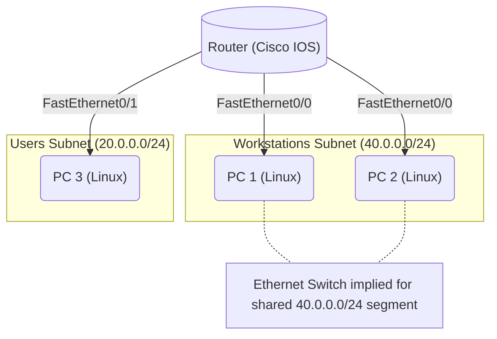

# Network Topology Schema

This document defines the visual topology of the GNS3 network to help the AI understand the physical layout.

## Graph Diagram

## Physical Wiring Table

| Device A | Interface A     | Device B | Interface B | Subnet       |
|----------|-----------------|----------|-------------|--------------|
| Router   | FastEthernet0/0 | PC 1     | eth0        | 40.0.0.0/24 |
| Router   | FastEthernet0/0 | PC 2     | eth0        | 40.0.0.0/24 |
| Router   | FastEthernet0/1 | PC 3     | eth0        | 20.0.0.0/24 |

> **Note**: The router uses **FastEthernet**, not standard Ethernet. ensure configuration commands use `interface FastEthernet0/0`.
